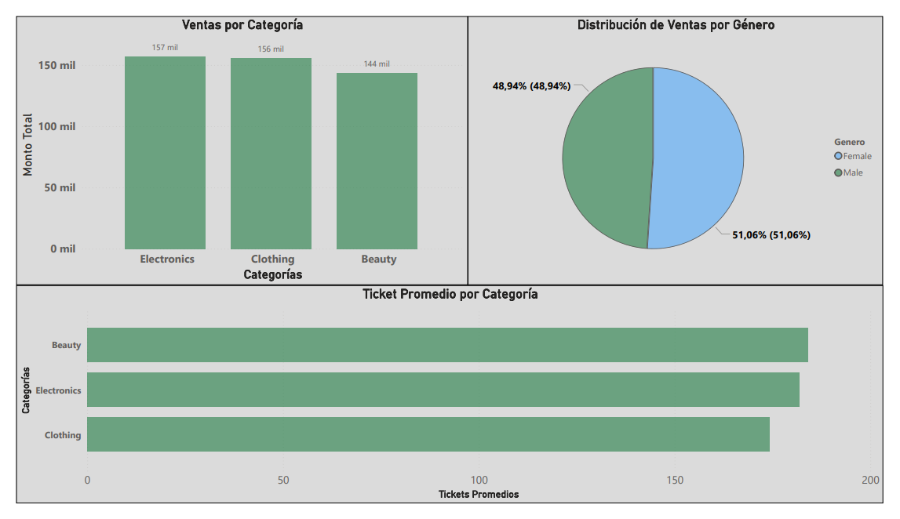

# 📊 Proyecto de Automatización de Reportes de Ventas

Este proyecto simula un proceso completo de análisis y generación de reportes de ventas utilizando técnicas de ingeniería de datos. Se construyó un pipeline ETL en Python para transformar datos crudos desde un archivo CSV, automatizar reportes en Excel, cargar los datos en MySQL y analizarlos mediante Power BI.

---

## 📌 Objetivos

- Automatizar el procesamiento de datos de ventas.
- Estandarizar y enriquecer la información con nuevas métricas.
- Facilitar la trazabilidad de los reportes generados mediante control de versiones.
- Cargar los datos en una base MySQL para facilitar su análisis.
- Visualizar los resultados de forma clara para la toma de decisiones.

---

## 🧩 Stack Tecnológico

- **Lenguaje:** Python 3
- **Librerías:** Pandas, SQLAlchemy, OpenPyXL, Seaborn, Matplotlib
- **Base de Datos:** MySQL 8
- **Herramientas de visualización:** Excel, Power BI

---

## 🔄 Flujo del proyecto

1. **ETL** (`etl.py`):  
   - Carga `Ventas.csv`
   - Limpia columnas innecesarias
   - Convierte fechas
   - Calcula ticket promedio
   - Filtra registros inválidos (precios/cantidades <= 0)
   - Exporta como `Ventas_limpio.csv`

2. **Carga en base de datos** (`subirdb.py`):  
   - Elimina columna basura si existe (`MyUnknownColumn`)
   - Limpia tabla `ventas`
   - Inserta datos del CSV limpio a MySQL

3. **Generación de reportes** (`exportar.py`):  
   - Agrupa ventas por categoría
   - Exporta archivo Excel con dos hojas:
     - Datos limpios
     - Resumen por categoría
   - Automatiza la creación de carpetas por fecha

4. **Visualización en Power BI**:  
   - Análisis de ticket promedio, ventas por género, ingresos mensuales, etc.

---

## 📊 Visualización del dashboard

---

## 📈 Gráficos destacados

- Ventas por categoría de producto
- Ingresos mensuales (tendencia)
- Distribución de ventas por género
- Ticket promedio por categoría

---